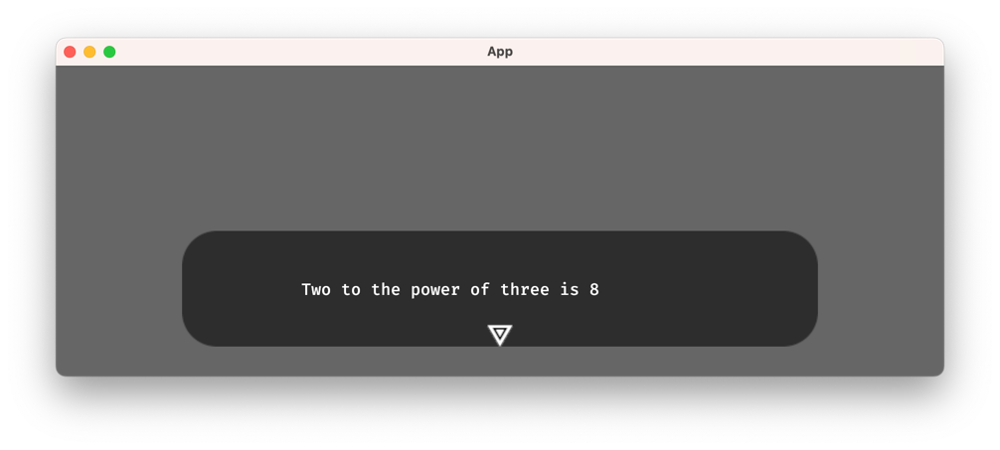

# Custom Functions

As mentioned in the chapter [Functions](../yarn_files/functions.md), Yarn can access user-defined functions.
A collection of functions is called a *library* and can be accessed through a `DialogRunner`.

## Function Registration

For an easy example, let's modify the code used in the [setup](./setup.md) to provide a simple `pow` function to Yarn:
```rust
fn spawn_dialogue_runner(mut commands: Commands, project: Res<YarnProject>) {
    let mut dialogue_runner = project.create_dialogue_runner();
    // Add our custom function to the dialogue runner
    dialogue_runner.library_mut().add_function("pow", pow);
    dialogue_runner.start_node("Start");
    commands.spawn(dialogue_runner);
}

fn pow(base: f32, exponent: f32) -> f32 {
    base.powf(exponent)
}
```

The following snippet is of special importance:
```rust
dialogue_runner.library_mut().add_function("pow", pow);
```
The first parameter of `add_function()` is the name of the function as seen by Yarn, `"pow"` in this case.
The second parameter is the Rust function that will be called in the background. 
Here, we reference the function definition of `fn pow(...)`, but you could also register a lambda.


This `pow` function can now be called from the Yarn file like this:

```text
title: Start
---
Two to the power of three is {pow(2,3)}
===
```

Which will result in the following output:


## Allowed Signatures

TODO
