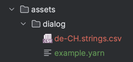
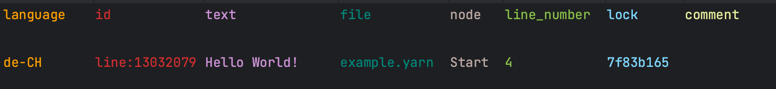
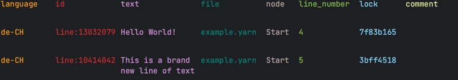
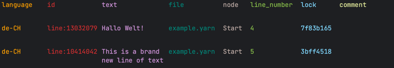

# Localization

If you only want to support a single language, you can safely ignore localization features.
As soon as you want to support [assets](assets.md) or multiple languages however, you will need to use localization.
Fortunately Yarn Slinger makes this quite easy!

Let's first look at how to use localization and then explain what's going on under the hood.

## Using Localization the Easy Way

We specify our supported localizations when creating the [`YarnSlingerPlugin` (or using deferred compilation)](compiling_yarn_files.md):

```rust
YarnSlingerPlugin::new().with_localizations(Localizations {
    base_localization: "en-US".into(),
    translations: vec!["de-CH".into()],
})
```

The *base localization* is the language in which your Yarn files are already written. 
In this case, we specified that our Yarn file was written in English as spoken in the USA.
The *translations* are all languages you want to support. Here, we want to support German as spoken in Switzerland.

Put the code shown above into the example used in the [setup](setup.md) and run the game. 

Now take a look at your Yarn file at `assets/dialog/example.yarn`. 
You will see that your line of dialog will contain an autogenerated ID, for example:
```diff
# assets/dialog/example.yarn
title: Start
---
- Hello World!
+ Hello World! #line:13032079 
===
```
This ID uniquely references this line across translations.
For the sake of clarity, we will use diff highlighting throughout this chapter.
In case you're not familiar with this look, for our purposes the red line started by "- " shows how the line looked like before a change,
while the green line started by "+ " shows how the line looks like after the change. The "- " and "+ " are just visual indicators and not actually part
of the files, so don't let that confuse you!

You will probably also have noticed a new file in your assets that was not there before, namely "de-CH.strings.csv":



This file is called a *strings file*, because it contains translations of each *string* of text of your Yarn files.
Let's see what it contains:

```csv
language,id,text,file,node,line_number,lock,comment
de-CH,line:13032079,Hello World!,example.yarn,Start,4,7f83b165,
```

Since this is a CSV, let's open it in an application that renders the content as a table:


You can see that our line from before is in there! Notice how the `id` matches across the files.

This file will be populated with new entries as soon you change the Yarn files. Assuming that you
are using hot reloading as described in the [setup](setup.md), run your app again in case you closed it or advanced the dialog.
While you are greeted with the "Hello World!" message on screen, open the Yarn file and edit it. Let's add a new line:

```diff
# assets/dialog/example.yarn
title: Start
---
Hello World! #line:13032079 
+ This is a brand new line of text
===
```

Save the file while the game is still running. You should see that our new line just got assigned an own line ID:

```diff
# assets/dialogue/example.yarn
title: Start
---
Hello World! #line:13032079
- This is a brand new line of text
+ This is a brand new line of text #line:10414042 
===
```
In case you can't see this, your editor might still have the old state of the file cached. It usually helps to change focus, tab out to another window, or closing and reopening the editor.
The strings file should now also contain a new entry:



Let's translate some of this. Change the string "Hello World!" in this file to "Hallo Welt!", which is German, and save it:



The game will currently happily ignore this as by default it uses the base language, which means it will take
its text straight from the Yarn files. But we can easily switch the language:

```rust
fn spawn_dialogue_runner(mut commands: Commands, project: Res<YarnProject>) {
    let mut dialogue_runner = project.create_dialogue_runner();
    dialogue_runner.start_node("Start");
    dialogue_runner.set_language("de-CH"); // Use our translation
    commands.spawn(dialogue_runner);
}
```

Run the game again and you should be greeted by this text: 


Hurray! See how painless localization can be?

## Languages

Languages are specified according to IETF BCP 47.
You can add as many translations as you want. Each will receive an own strings file. 

To switch languages at runtime, simply retrieve a `DialogRunner` through a Bevy query inside a system.
When you use `DialogRunner::set_language()` as shown above, you will set the language for both text and assets.
You can be more granular by using `DialogRunner::set_text_language()` and `DialogRunner::set_asset_language()` separately instead.
This allows you to support use cases such as showing the text in the player's native language and play voiceover sound in the original recorded language, which might be a different one.

## Assets

Since assets require using localization, they are searched for in folders named after the language they support. 
For the example used throughout this chapter, the assets for the base localization would be searched for in `assets/dialog/en-US/`, while the assets for the `de-CH` 
translation will be searched at `assets/dialog/de-CH/`. This is however more a convention than a rule, as a given `AssetProvider` is allowed to look for its assets wherever.
The asset providers shipped by Yarn Slinger will additionally expect assets to be named after the line ID they belong to. For example, the `AudioAssetProvider` would look for the
voice line reading our "Hello World!" line at `assets/dialog/en-US/13032079.mp3` for the base localization.

To read more about how to use assets, read the chapter [Assets](./assets.md).

## File Editing Workflow

The strings file can be freely edited by a translator in the *text* and *comment* fields. 
While you can translate the texts yourself, the format being straightforward allows the translator to also be someone else that is not involved with the coding part of the game at all.

You might have some questions regarding what happens when one person edits a Yarn file while another edits the strings file. As a general rule,
the strings file will try to "keep up" with the Yarn file without ever destroying anything that was already translated.  

As you've seen, new lines will be amended. If the Yarn file has a line edited, it will be changed in the strings file as well if it was not yet translated. 
If there is already a translation, it will be marked by a "NEEDS UPDATE" prefix in the text. If a line was deleted in the Yarn file, it will also be deleted
in the strings file if it was untranslated. Otherwise, it will be left untouched. 

Bottom line: if there's a translation, it will **never** be removed.

## Shipping the Game

Once you want to build your game for a release, you should disable the automatic file creation and editing.
To do this, add the following line to the plugin creation:
```rust
YarnSlingerPlugin::new()
// ...
.with_development_file_generation(DevelopmentFileGeneration::None)
```

This will change the behavior of missing translations to simply fall back to the base localization.

While you're on it, you might also want to disable Bevy's hot reloading.

## Customization

You may have wondered what the `.into()`s were for in the lines at the beginning of the chapter:

```rust
YarnSlingerPlugin::new().with_localizations(Localizations {
    base_localization: "en-US".into(),
    translations: vec!["de-CH".into()],
})
```

They're here because a localization is not just a string with a language code, but an entire struct, namely `Localization`.
You can construct this struct directly the path to the strings file and where assets are searched for.
