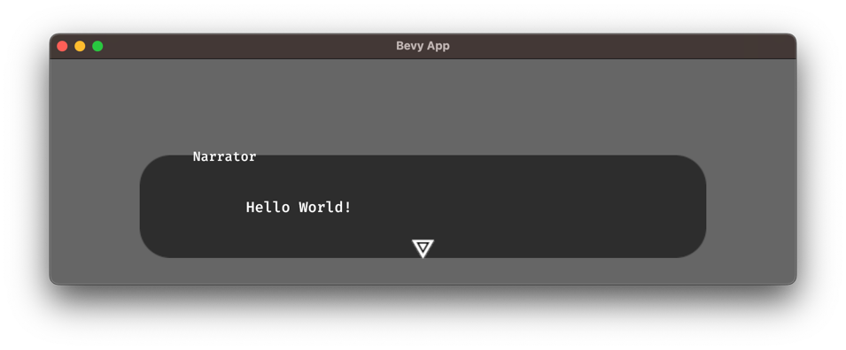

# Lines

As you might have figured out by playing around with the file from last chapter, a *line*
can be spoken by a character. The following Yarn file...
```text
title: Start
---
Narrator: Hello World!
===
```

Results in this dialogue window:


Notice how the character name, in this case "Narrator", appears on the upper left corner of the dialogue box.

Every new line in the file is interpreted as a new line in the dialogue. Try running the following:

```text
title: Start
---
Narrator: Hello World!
Narrator: How are you?
Player: I'm fine, thanks!
And everyone lived happily ever after.
===
```

If you're running the example in Yarn Slinger, you can advance the dialogue
by pressing the space bar, enter key, clicking the mouse, or tapping the screen. Remember that you can
change the Yarn file while the game is running, so no need to restart the program!
