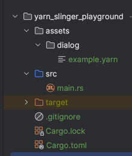

# Running Examples

You can run Yarn files by copy-pasting them into [Try Yarn Spinner](https://try.yarnspinner.dev).
This is nice because it runs directly in your browser and so doesn't require any setup. Since Yarn Spinner
and Yarn Spinner read Yarn files the same way, the behavior will be identical to how it would be in your game.
The only thing to look out for is that Try Yarn Spinner will only start at a node named "Start".

If you want to see the result of your Yarn files in an actual game window, you can
setup a little example project. We will use screenshots from such a setup throughout the book.

If you want to follow along this way setup the crate by running the following commands.

```bash
cargo new yarnspinner_playground
cd yarnspinner_playground
cargo add bevy --features filesystem_watcher
cargo add bevy_yarnspinner bevy_yarnspinner_example_dialogue_view
```

Then, in your `src/main.rs`, add the following code:

```rust
// src/main.rs
use bevy::{prelude::*, asset::ChangeWatcher, utils::Duration};
use bevy_yarnspinner::prelude::*;
use bevy_yarnspinner_example_dialogue_view::prelude::*;

fn main() {
    let mut app = App::new();

    app.add_plugins((
        DefaultPlugins.set(AssetPlugin {
            watch_for_changes: ChangeWatcher::with_delay(Duration::from_millis(200)),
            ..default()
        }),
        YarnSlingerPlugin::new(),
        ExampleYarnSlingerDialogueViewPlugin::new(),
    ))
    .add_systems(Startup, setup_camera)
    .add_systems(
        Update,
        spawn_dialogue_runner.run_if(resource_added::<YarnProject>()),
    )
    .run();
}

fn setup_camera(mut commands: Commands) {
    commands.spawn(Camera2dBundle::default());
}

fn spawn_dialogue_runner(mut commands: Commands, project: Res<YarnProject>) {
    let mut dialogue_runner = project.create_dialogue_runner();
    dialogue_runner.start_node("Start");
    commands.spawn(dialogue_runner);
}
```

Don't worry, we will look at what this code does in detail later, in the chapter [Bevy Plugin / Setup](../bevy_plugin/setup.md). 
For now, just treat it as something that runs your Yarn files.

Finally, add your Yarn files to the assets. Inside the folder `assets/dialogue`, add a file named `example.yarn` with the content
you want to run. Let's use the example from the last chapter:

```text
# assets/dialogue/example.yarn
title: Start
---
Hello World!
===
```

Your file structure should now look like this:



Run your game with `cargo run` and you should see the following:


It might have taken a while to compile, but the good news is that the code you're running now
supports _hot reloading_, which means that you can change your Yarn file and save it while the game is running
and the changes will be visible immediately, as long as you didn't already close the dialog by completing it.
No recompilation required!

Try it out now. Can you make the dialogue say "Goodbye World!" instead?
What happens when write the text as if a character spoke it, e.g. "Narrator: Hello World!"?

In the next chapters, we are going to take a closer look at what you can write inside a Yarn file.
